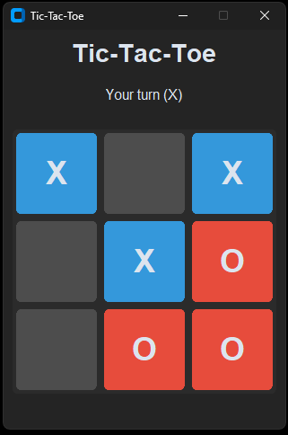

# Tic-Tac-Toe

## Description

Une implémentation du jeu Tic-Tac-Toe (aussi connu sous le nom OXO) en python. Le projet possède une architecture modulaire séparant la logique métier de l'interface.

<p align="center">
  
</p>

## Fonctionnalités

- Interface Graphique Moderne : Utilisation de CustomTkinter pour un rendu propre.
- Configurable : Architecture prévue pour changer facilement la taille de la grille ou les conditions de victoire.
- Expérience Utilisateur : Choix du symbole de départ (X ou O) et gestion fluide des tours.
- Mode Solo : Jouez contre l'ordinateur.
- Rejouabilité : Possibilité de relancer une partie sans redémarrer le programme.

## Architecture & Choix techniques

Ce projet a été conçu en respectant le principe de Séparation des Responsabilités (SoC). L'application est divisée en plusieurs modules distincts pour garantir la maintenabilité et l'évolutivité du code.

### Structure du projet

- src/board.py : Encapsule l'état de la grille de jeu et contient les méthodes de manipulation de données.

- src/rules.py : Contient la logique pure de vérification de victoire.

- src/player.py : Gère la logique de l'ordinateur.

- src/ui.py : Gère l'intégralité de l'interface utilisateur et fait le lien entre les actions de l'utilisateurs et la logique métier.

- src/main.py : Point d'entrée de l'application.

### Note sur la méthodologie de développement

Dans une optique d'efficacité, j'ai utilisé un assistant IA comme accélérateur de productivité pour la partie Front-end. L'IA a été sollicitée pour générer le "boilerplate" visuel (positionnement des widgets customtkinter, choix des couleurs et paddings).

L'intégralité du moteur de jeu (Back-end), l'architecture modulaire, ainsi que toute la logique événementielle (le lien entre les clics et les règles métier) ont été conçus et implémentés manuellement.

## Installation

### Cloner le projet

```bash
git clone https://github.com/Djingoo/tictactoe
cd tictactoe
```

### Créer un environnement virtuel (optionel)

```bash
python -m venv venv
```

Pour activer sur Windows :

```bash
venv\Scripts\activate
```

Pour activer sur Mac/Linux :

```bash
source venv/bin/activate
```

### Installation des dépendances

```bash
pip install -r requirements.txt
```

## Utilisation

```bash
python src/main.py
```

## Lancement des tests

Depuis la racine du projet :

Sur Windows :

```bash
$env:PYTHONPATH = "src"
python -m unittest discover -s tests -t .
```

Sur Mac/Linux :

```bash
export PYTHONPATH=$PYTHONPATH:$(pwd)/src
python3 -m unittest discover -s tests -t .
```
## Technologies

- Python
- customtkinter

## Auteur

Diego Alarcon

## License

MIT License
